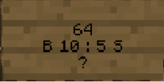
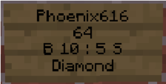

# How to Create a Chest Shop

Chest Shops allow players to create simple and effective player-run shops using signs and chests. Follow these steps to set up your own Chest Shop:

## Steps to Create a Chest Shop

1. **Place a Chest:**
   - Start by placing a chest on the ground. This will store the items you are buying or selling.

2. **Place a Sign:**
   - Place a sign 1 block away from the chest (e.g., above, below, or next to it).

3. **Write on the Sign:**
   - Write the following on the sign:

     ```
     [Your Username]   (Automatically filled in by the plugin)
     [Quantity]        (Number of items to buy/sell)
     [B Price : S Price] (Set a Buy price, Sell price, or both. Use ":" to separate them.)
     [Item Name or ID] (Write "?" to autofill after placing the sign.)
     ```

### Example Sign:



- In this example:
  - The quantity is `64`
  - The price is `B 10 : S 5` (Players can buy for 10 and sell for 5)
  - The item will autofill or display manually entered details.

## Notes on Sign Formatting

- **Line 1:**
  - This line is automatically filled with your username. 

- **Line 2:**
  - Enter the quantity of the item for the transaction.

- **Line 3:**
  - Define the price for buying (`B`) or selling (`S`) or both. Prices are separated by a colon `:`.
  - Examples:
    - `B 10 : S 5` - Players can buy for 10 and sell for 5.
    - `B 10` - Players can only buy for 10.
    - `S 5` - Players can only sell for 5.

- **Line 4:**
  - Add the name or ID of the item being traded. Writing `?` here will autofill the item from the chest.

### Example Shop:



- In this shop:
  - The player is selling `64` diamonds for `10` and buying them back for `5`.

## Additional Tips

- **Checking Item Names/IDs:**
  - To find the item name or ID, hold the item in your hand and run the `/iteminfo` command.

- **Autofilling:**
  - If you use `?` on the fourth line, the plugin will automatically detect the item in the chest and update the sign.

- **Transaction History:**
  - Check your transaction history with `/csn history`. This command shows you all the transactions that have occurred in your Chest Shops since you last checked.

With these steps, you can set up your shop and start trading with other players in your Minecraft world!

