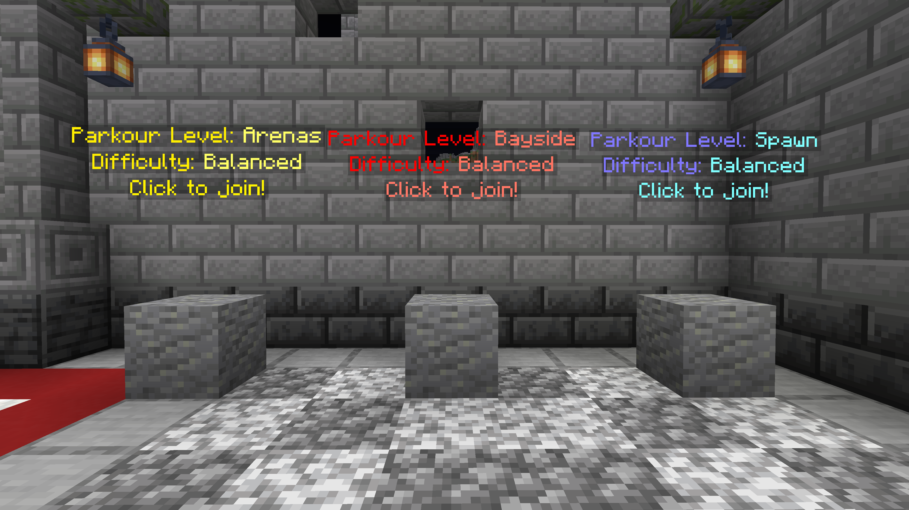

# Parkour

Head to our Parkour hub and test your skills in various arenas! You can jump right into the action with a simple command or browse through the hub to find your favorite arena.

## Getting Started

- **Warp to the Hub:** Use `/warp parkour` to access the Parkour hub, where you can browse and select arenas.
- **Quick Start:** Type `/ajp start` to instantly begin a game in your most recently played arena.

In the hub, each arena is represented by a hologram. The hologram displays the arena's name, location, and difficulty level. To start, right-click the hologram of your chosen arena.

<figure></figure>

When the round begins, navigate a series of challenging jumps from block to block, avoiding falls at all costs. If you miss a jump, you'll be teleported back to the hub to try again or choose a new arena.

## Rewards and Leaderboards

- **Climb the Leaderboard:** Your jumps earn you points and status on the **Parkour leaderboard** with `/ajp top`.
- **Earn Denarii:** Gain Denarii every 5 jumps! The amount increases as you keep going.

## Parkour Commands

Here are the key commands to master Parkour gameplay:

- `/ajp`: Displays all available parkour commands.
- `/ajp start <arena>`: Starts a round in the most recent arena you played.
- `/ajp list`: Shows who else is currently playing Parkour.
- `/ajp top`: Displays the top 10 players with the most jumps.

Get ready to jump, earn, and compete for glory on Theatria's Parkour arenas!
